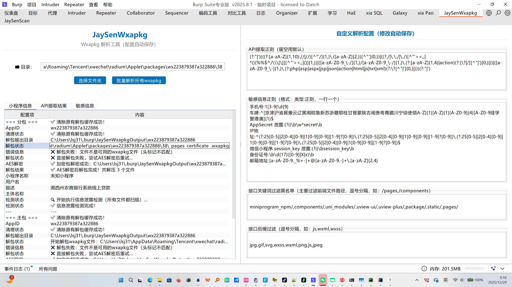
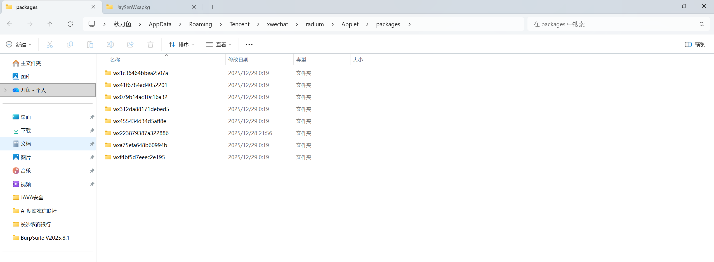
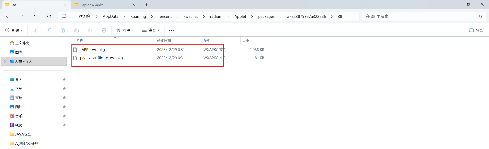
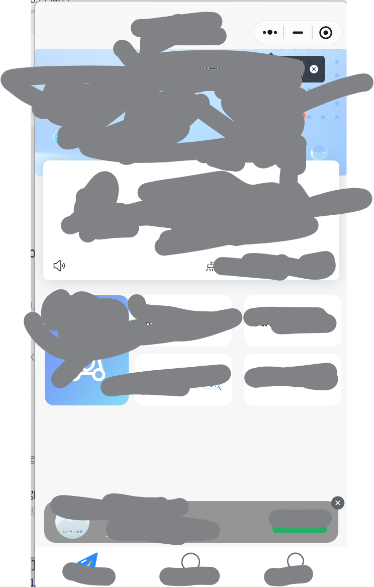
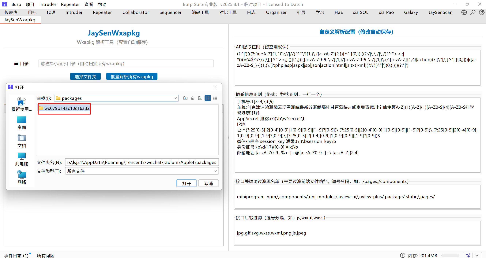
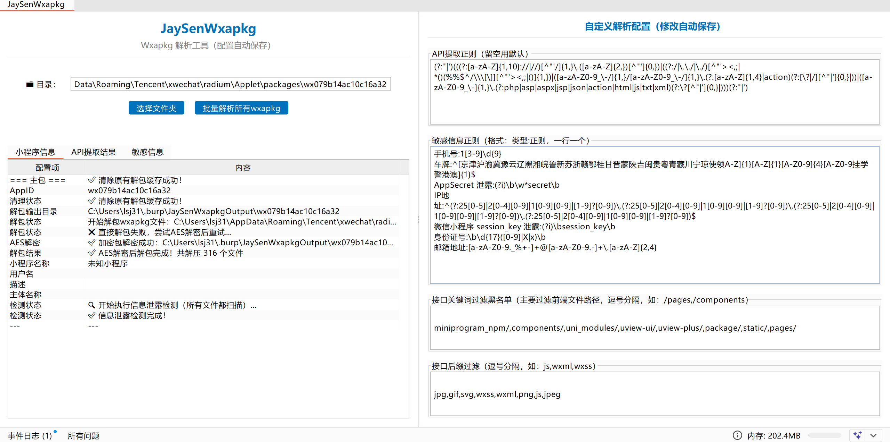
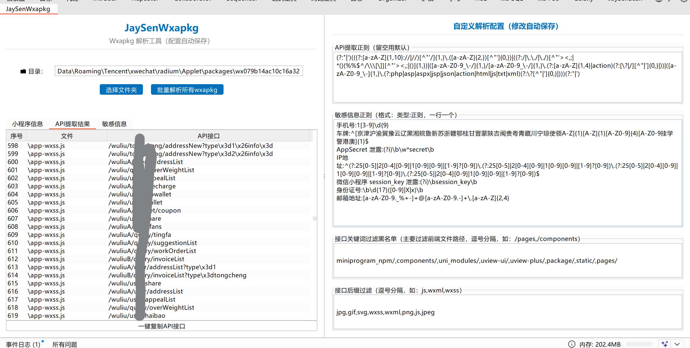

# 🔥 JaySenWxapkg - Burp微信小程序渗透测试利器

> 支持微信最新版，可解**大部分微信小程序wxapkg包**，一键自动解密+批量解包+API接口提取+敏感数据泄露检测，Burp可视化操作，配置自动保存！



## 📋 功能清单
| 功能模块         | 核心能力                                                     |
| ---------------- | ------------------------------------------------------------ |
| 🔓 wxapkg解密     | 自动识别加密包，AES-CBC+XOR解密，兼容PC微信小程序缓存包      |
| 📦 批量解包       | 递归扫描目录，多线程解包主包/分包，自动清理缓存              |
| 🚪 API提取        | 自定义正则规则，过滤前端路径（pages/components等），一键复制所有接口 |
| 🔍 敏感检测       | 内置手机号、身份证、AppID、密钥等规则，支持自定义敏感类型正则 |
| ⚙️ 灵活配置       | 接口前缀/后缀黑名单、API正则、敏感信息正则，修改自动保存     |
| 📊 可视化面板     | 小程序信息、API结果、敏感数据分栏展示，清晰直观              |
| 📱 小程序信息查询 | 自动提取AppID，查询小程序名称、主体、描述等基础信息          |

## 🛠️ 快速上手

找到微信的小程序包生成路径，默认是

`C:\Users\你的用户名\AppData\Roaming\Tencent\xwechat\radium\Applet\packages\`

找不到的可以全局findsomething搜索一下packages





这里会有很多包，每一个包代表一个小程序，部分包还存在多个wxapkg文件，由于不知道哪个包是哪个小程序，先全部删除



打开需要提取信息的小程序后



在插件选择小程序的文件



自动解包文件夹下所有主包和分包，成功提取信息



并且可以配置右边的过滤机制，过滤掉匹配到的前端路径，和图片等等

## 📝 配置示例
### 敏感信息正则示例
```
手机号:1[3-9]\d{9}
车牌:^[京津沪渝冀豫云辽黑湘皖鲁新苏浙赣鄂桂甘晋蒙陕吉闽贵粤青藏川宁琼使领A-Z]{1}[A-Z]{1}[A-Z0-9]{4}[A-Z0-9挂学警港澳]{1}$
AppSecret 泄露:(?i)\b\w*secret\b
IP地址:^(?:25[0-5]|2[0-4][0-9]|1[0-9][0-9]|[1-9]?[0-9])\.(?:25[0-5]|2[0-4][0-9]|1[0-9][0-9]|[1-9]?[0-9])\.(?:25[0-5]|2[0-4][0-9]|1[0-9][0-9]|[1-9]?[0-9])\.(?:25[0-5]|2[0-4][0-9]|1[0-9][0-9]|[1-9]?[0-9])$
微信小程序 session_key 泄露:(?i)\bsession_key\b
身份证号:\b\d{17}([0-9]|X|x)\b
邮箱地址:[a-zA-Z0-9._%+-]+@[a-zA-Z0-9.-]+\.[a-zA-Z]{2,4}
```

### API提取正则示例（默认规则）
```
(?:"|')(((?:[a-zA-Z]{1,10}://|//)[^"'/]{1,}\.([a-zA-Z]{2,})[^"']{0,})|((?:/|\.\./|\./)[^"'><,;| *()(%%$^/\\\[\]][^"'><,;|()]{1,})|([a-zA-Z0-9_\-/]{1,}/[a-zA-Z0-9_\-/]{1,}\.(?:[a-zA-Z]{1,4}|action)(?:[\?|/][^"|']{0,}|))|([a-zA-Z0-9_\-]{1,}\.(?:php|asp|aspx|jsp|json|action|html|js|txt|xml)(?:\?[^"|']{0,}|)))(?:"|')
```

### 前缀/后缀黑名单示例
- 前缀黑名单：`/pages/,/components/,/static/,/uni_modules/,uview-ui/`
- 后缀黑名单：`jpg,gif,svg,wxss,wxml,png,js,jpeg`

## 📄 License
本项目基于 [MIT License](https://github.com/Jaysen13/jaysenwxapkg/blob/main/LICENSE) 开源，允许商业使用、二次开发，需保留原作者版权声明。

## 📞 联系作者
- GitHub：[Jaysen13](https://github.com/Jaysen13)
- 项目地址：[https://github.com/Jaysen13/jaysenwxapkg](https://github.com/Jaysen13/jaysenwxapkg)
- 邮箱：3147330392@qq.com