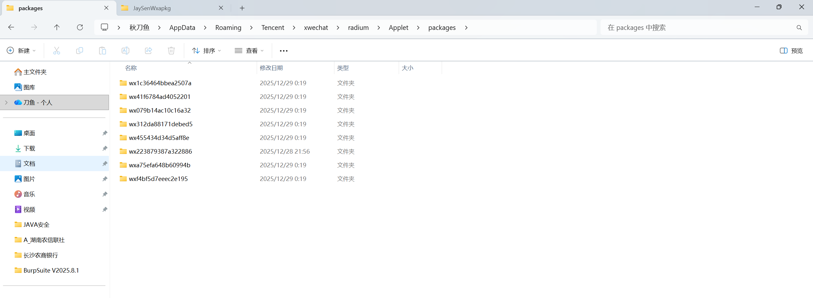
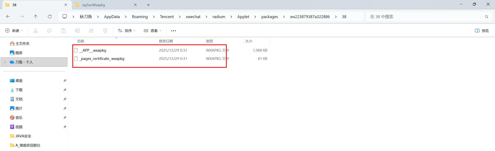
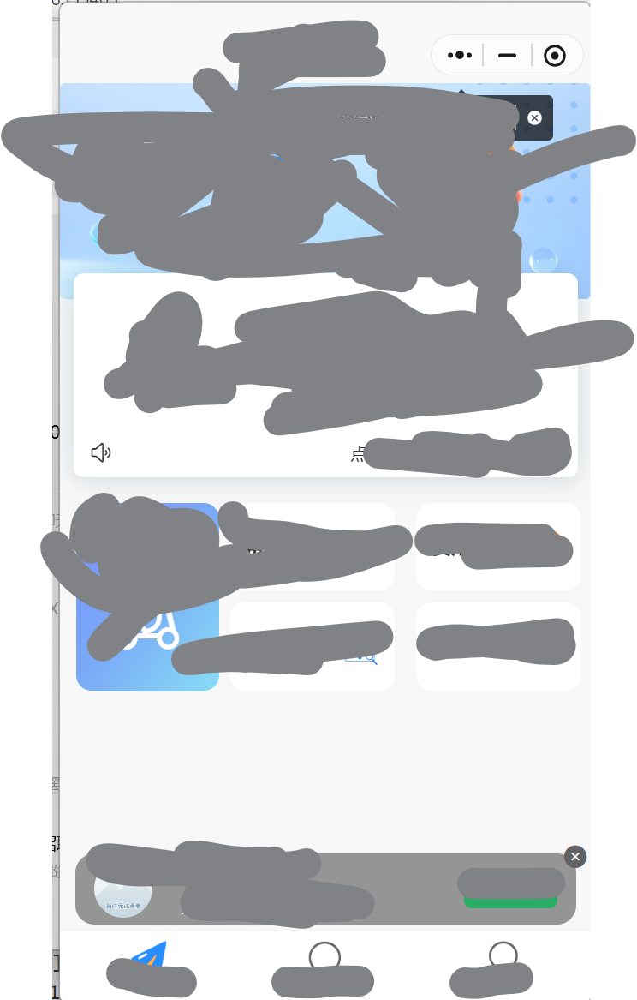
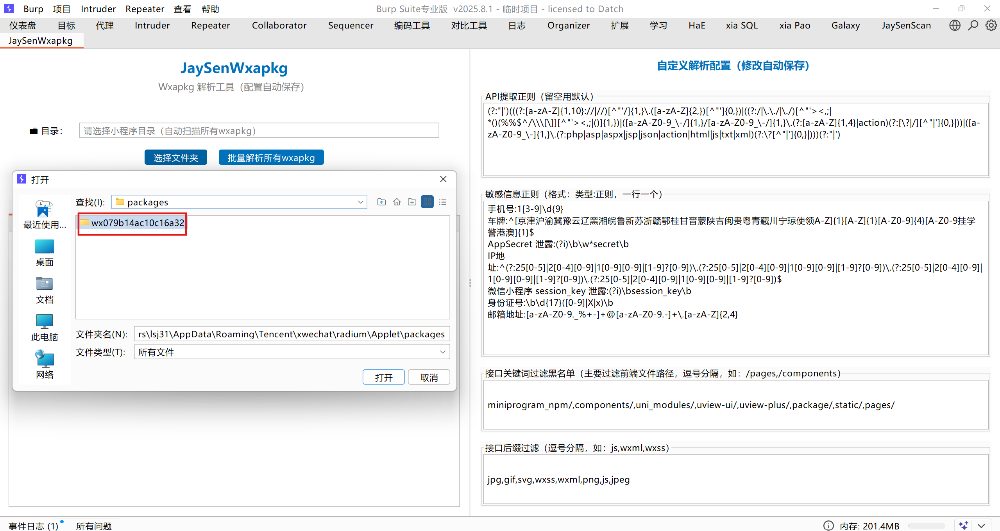
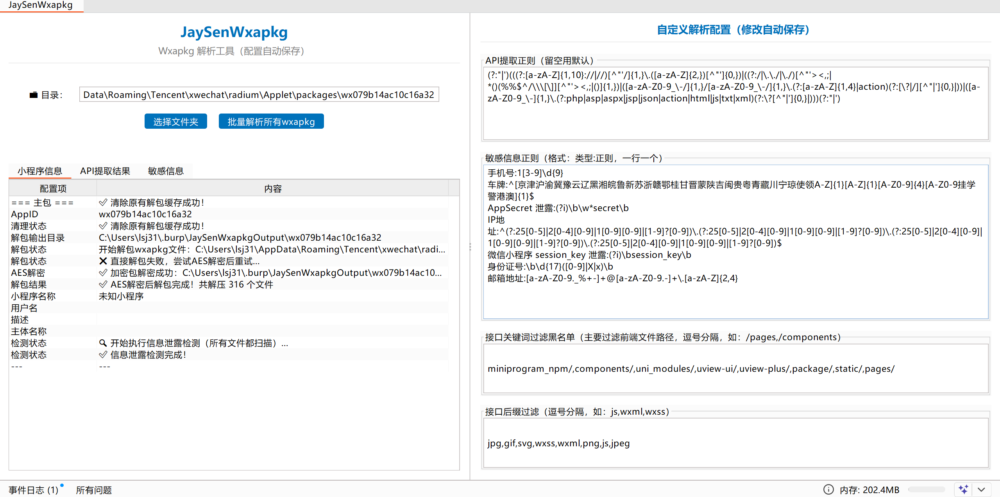
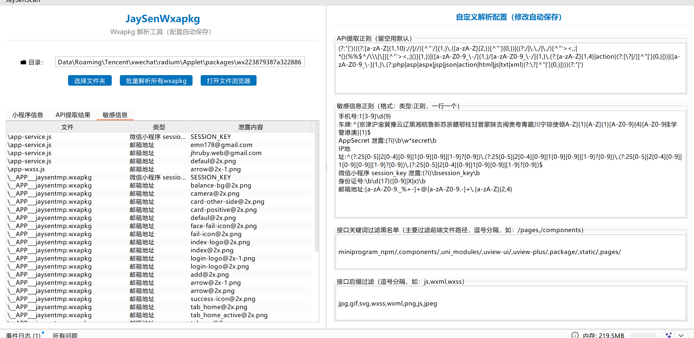
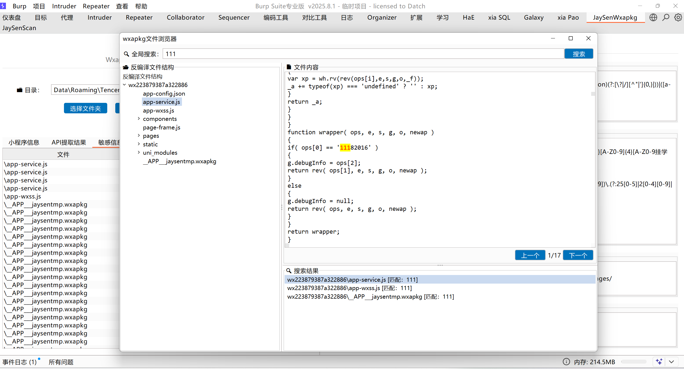

# 🔥 JaySenWxapkg - Burp微信小程序渗透测试利器

> 支持微信最新版，可解**所有微信小程序wxapkg包**，一键自动解密+批量解包+API接口提取+敏感数据泄露检测+AI参数推演，Burp可视化操作，配置自动保存！

[](https://github.com/Jaysen13/jaysenwxapkg/releases)[](https://github.com/Jaysen13/jaysenwxapkg)


## 📋 功能清单
| 功能模块         | 核心能力                                                     |
| ---------------- | ------------------------------------------------------------ |
| 🔓 wxapkg解密     | 自动识别加密包，AES-CBC+XOR解密，兼容PC微信小程序缓存包      |
| 📦 批量解包       | 递归扫描目录，多线程解包主包/分包，自动清理缓存              |
| 🚪 API提取        | 自定义正则规则，过滤前端路径（pages/components等），一键复制所有接口 |
| 🔍 敏感检测       | 内置手机号、身份证、AppID、密钥等规则，支持自定义敏感类型正则 |
| ⚙️ 灵活配置       | 接口前缀/后缀黑名单、API正则、敏感信息正则，修改自动保存     |
| 📊 可视化面板     | 小程序信息、API结果、敏感数据分栏展示，清晰直观              |
| 📱 小程序信息查询 | 自动提取AppID，查询小程序名称、主体、描述等基础信息          |
| 🤖 AI参数智能推测 | 结合反编译源码上下文，AI自动推测API请求参数，一键自动发送测试请求 |

## 🛠️ 快速上手

找到微信的小程序包生成路径，默认是（最最新版4.1.7.57已变）

`C:\Users\你的用户名\AppData\Roaming\Tencent\xwechat\radium\Applet\packages\`

新版：

```
C:\Users\你的用户名\AppData\Roaming\Tencent\xwechat\radium\users\32位字符串\applet\packages\
```

找不到的可以全局findsomething搜索一下packages





这里会有很多包，每一个包代表一个小程序，部分包还存在多个wxapkg文件，由于不知道哪个包是哪个小程序，先全部删除



打开需要提取信息的小程序后



在插件选择小程序的文件



自动解包文件夹下所有主包和分包，成功提取信息


并且可以配置右边的过滤机制，过滤掉匹配到的前端路径，和图片等等

成功反编译后可以点击**文件浏览功能**打开已编译后的文件





## 🤖 AI参数智能推测

解包提取到API接口后，可以切换到「AI参数推测」标签页，利用大模型自动推测每个接口的请求参数并一键发送测试请求。


### 使用流程

**1. 发送API到AI推测面板**

在解析结果页的「API接口」表格中，选中想要推测的接口（支持 **Shift / Ctrl 按住多选**），右键点击 → 「发送选中接口至AI参数智能推测页面」。


**2. 配置AI连接参数**

在「AI参数推测」标签页左侧填写 API 连接信息，支持 OpenAI / DeepSeek / 通义千问 等兼容接口：

| 参数 | 说明 |
|------|------|
| API Key | 大模型API密钥 |
| 模型URL | API端点地址（默认 DeepSeek） |
| 模型名称 | 模型标识（如 `deepseek-chat`） |
| 超时 | 请求超时秒数 |
| 上下文长度 | Prompt最大字符数（默认 24576） |
| 额外Headers | 适配不同API的认证头（JSON格式） |
| Prompt模板 | 自定义推测指令模板 |

填写完成后点击「测试AI连接」验证配置是否正确。


**3. 开始推测**

选中API列表中的条目（Shift/Ctrl多选），点击「发送选中至AI」。系统会自动：

- 提取每条API在**反编译源码中的上下文**（解包时已预提取，精确匹配 API 路径所在代码行及周围代码）
- 结合 **Burp 历史中同域名下的真实请求**作为参考，让 AI 了解开发者的参数命名风格
- 自动检测并**补全 URL 前缀**（如已观测接口统一使用 `/shop/api/`，则自动修正缺少前缀的接口）


**4. 执行AI生成的请求**

AI返回推测结果后，插件自动解析其中的HTTP请求块，直接通过 Burp 发送到目标服务器。左下角「请求执行结果」面板实时显示每个请求的发送状态（成功/失败），**数据包详情在burp自带的日志内查看**。

日志视图过滤器输入**aijaysenwxapkg**筛选即可


### ai对话日志示例展示


### 核心亮点

- **源码级上下文**：解包时自动提取每个API周围的源码片段（前后各5行），AI基于真实代码推测参数，准确度远超纯路径推测
- **命名风格学习**：AI分析同域名下已观测到的真实请求，总结开发者的命名习惯后再推测新接口
- **自动前缀修正**：解决小程序代码中 `baseUrl` 拼接导致的路径不完整问题
- **一键执行**：无需手动构造请求，AI推测→自动发送→结果查看一气呵成

## 📝 配置示例
### 敏感信息正则示例
```
手机号:1[3-9]\d{9}
车牌:^[京津沪渝冀豫云辽黑湘皖鲁新苏浙赣鄂桂甘晋蒙陕吉闽贵粤青藏川宁琼使领A-Z]{1}[A-Z]{1}[A-Z0-9]{4}[A-Z0-9挂学警港澳]{1}$
AppSecret 泄露:(?i)\b\w*secret\b
IP地址:^(?:25[0-5]|2[0-4][0-9]|1[0-9][0-9]|[1-9]?[0-9])\.(?:25[0-5]|2[0-4][0-9]|1[0-9][0-9]|[1-9]?[0-9])\.(?:25[0-5]|2[0-4][0-9]|1[0-9][0-9]|[1-9]?[0-9])\.(?:25[0-5]|2[0-4][0-9]|1[0-9][0-9]|[1-9]?[0-9])$
微信小程序 session_key 泄露:(?i)\bsession_key\b
身份证号:\b\d{17}([0-9]|X|x)\b
邮箱地址:[a-zA-Z0-9._%+-]+@[a-zA-Z0-9.-]+\.[a-zA-Z]{2,4}
```

### API提取正则示例（默认规则）
```
(?:"|')(((?:[a-zA-Z]{1,10}://|//)[^"'/]{1,}\.[a-zA-Z]{2,}[^"']{0,})|((?:/|\.\./|\./)[a-zA-Z0-9_\-.][^"'><,;| *()(%%$^\\\[\]]{0,}(?:/[^"'><,;|()*]{1,})*)|([a-zA-Z][a-zA-Z0-9_\-]*/[a-zA-Z0-9_\-./]{1,})|([a-zA-Z0-9_\-/]{1,}/[a-zA-Z0-9_\-./]{0,}\.[a-zA-Z]{1,6}(?:\?[^"']{0,}|)))(?:"|')
```

### 前缀/后缀黑名单示例
- 前缀黑名单：`/pages/,/components/,/static/,/uni_modules/,uview-ui/`
- 后缀黑名单：`jpg,gif,svg,wxss,wxml,png,js,jpeg`

## 📄 License
本项目基于 [MIT License](https://github.com/Jaysen13/jaysenwxapkg/blob/main/LICENSE) 开源，允许商业使用、二次开发，需保留原作者版权声明。

## 📞 联系作者
- GitHub：[Jaysen13](https://github.com/Jaysen13)

- 项目地址：[https://github.com/Jaysen13/jaysenwxapkg](https://github.com/Jaysen13/jaysenwxapkg)

- 邮箱：3147330392@qq.com

- 微信公众号：**凌霜雁安全志**

  后续公众号会不定期分享网络安全类知识和工具推荐，欢迎关注~


## ⭐ Star 历史趋势

 如果这个项目对你有帮助，欢迎点亮 Star 支持一下！ 您的start，我的动力


[](https://star-history.com/#Jaysen13/jaysenwxapkg&Date)